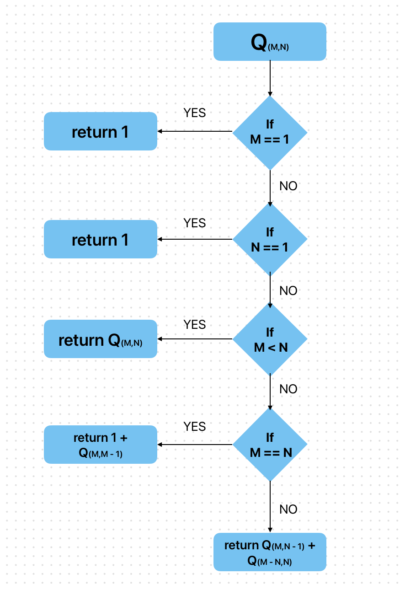

<!-- #region editable=true slideshow={"slide_type": ""} -->
## Лабораторная работа № 6  (Итеративные и рекурсивные алгоритмы)
**Выполнил**: Камалов Ринат,  **Группа**: ИУ10-36
<!-- #endregion -->

### **Цель работы** 

Изучить рекурсивные алгоритмы и рекурсивные структуры данных; 
научиться проводить анализ итеративных и рекурсивных процедур; 
исследовать эффективность итеративных и рекурсивных процедур при реализации на ПЭВМ.

#### **1. Реализуйте рекурсивный алгоритм подсчета**
Q<sub>MN</sub> - числа способов, с помощью которых можно представить целое число М в виде суммы,
каждое слагаемое которой не превосходит N.

```python
def Q(m, n):
    if m == 1:
        return 1
    if n == 1:
        return 1
    if m < n:
        return Q(m, m)
    if m == n:
        return 1 + Q(m, m - 1)
    if m > n:
        return Q(m, n - 1) + Q(m - n, n)

m = 10
n = 5
print(Q(m,n))
```

#### **2. Реализуйте алгоритмы из задания 1 не используя рекурсию.**

```python
def count_ways(m, n):
    Q = [[0] * (n + 1) for _ in range(m + 1)]

    for n in range(n + 1):
        Q[1][n] = 1

    for m in range(m + 1):
        Q[m][1] = 1

    for m in range(2, m + 1):
        for n in range(2, n + 1):
            if m < n:
                Q[m][n] = Q[m][m]
            elif m == n:
                Q[m][n] = 1 + Q[m][n - 1]
            else:
                Q[m][n] = Q[m][n - 1] + Q[m - n][n]

    return Q[m][n]

m = 10
n = 5
print(count_ways(m, n))
```

#### **2. Для каждого реализованного алгоритма:**
- **составьте блок-схему;**

- **оцените верхнюю границу размерности задачи, для которой при рекурсивной реализации не происходит переполнение стека вызовов;
Переполнение стека вызовов возникает, когда глубина рекурсии становится слишком большой. 
В данном случае глубина рекурсии зависит от значений \( M \) и \( N \).**

При наиболее неблагоприятных условиях (когда \( M \) и \( N \) велики), в худшем случае, глубина рекурсии может достигать \( M \). Причина в том, что когда \( M > N \), рекурсивные вызовы \( Q(M, N-1) \) и \( Q(M-N, N) \) могут привести к последовательному уменьшению значений \( N \), а значение \( M \) может оставаться большим. 

Рекурсия останавливается, когда мы достигаем базовых случаев, в основном при уменьшении \( N \) до значения 1 или при уменьшении \( M \) до значения 1. Таким образом, можно ожидать, что стек будет удерживать значения, которые в худшем случае могут вести к \( M \) равному 0, а также значения для всех \( N \) от начального значения до 1.

Для ограниченной глубины стека (например, 1000 вызовов), можно бы сделать следующее предположение:
Если печатать глубину стека вызовов более 1000, то необходимо ограничиться величинами \( M \) и \( N \) такими, что \( M \) не превышает порядка 1000.

Таким образом, предел \( M \) не должен превышать, скажем, 500 для того, чтобы предотвратить переполнение стека, учитывая, что полный диапазон значений \( N \) также влияет на количество вызовов.

Тем не менее, для получения точного числа, вам необходимо выполнить тесты с заданными значениями \( M \) и \( N \), а также учитывать производительность вашей системы при задании ограничений.
- **модернизируйте рекурсивную реализацию так, чтобы сохранялись промежуточные результаты вызова рекурсии (реализуйте подобный механизм вручную, а также, с помощью декоратора);**
```python
def Q(m, n, memo=None):
    if memo is None:
        memo = {}
    if (m, n) in memo:
        return memo[(m, n)]

    if m == 1:
        return 1
    if n == 1:
        return 1
    if m < n:
        result = Q(m, m, memo)
    elif m == n:
        result = 1 + Q(m, m - 1, memo)
    else:
        result = Q(m, n - 1, memo) + Q(m - n, n, memo)

    memo[(m, n)] = result
    return result

m = 10
n = 5
print(Q(m, n))

from functools import lru_cache

@lru_cache(maxsize=None)
def Q(m, n):
    if m == 1:
        return 1
    if n == 1:
        return 1
    if m < n:
        return Q(m, m)
    elif m == n:
        return 1 + Q(m, m - 1)
    else:
        return Q(m, n - 1) + Q(m - n, n)


m = 10
n = 5
print(Q(m, n))

```
- **сравните производительность реализованных алгоритмов (количество итераций (соответственно вызовов рекурсии) подбирайте исходя из условий задачи).**
```python
call_counter = 0

def Q(m, n):

    global call_counter
    call_counter += 1

    if m == 1:
        return 1
    if n == 1:
        return 1
    if m < n:
        return Q(m, m)
    if m == n:
        return 1 + Q(m, m - 1)
    else:
        return Q(m, n - 1) + Q(m - n, n)

m = 10
n = 5
print(Q(m,n))
print(call_counter)

```